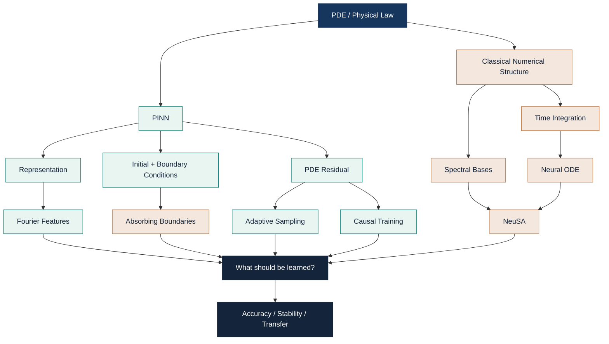

<div align="center">

# PINNs @ IMPA

## Scientific Machine Learning  
### From Physics-Informed Losses to Structured Neural Dynamics

<br>

**A living mathematical notebook, implementation log, and interactive research atlas**

<br>

[](https://esteargmartacosta.github.io/PINNS-IMPS-LECTURE-COURSE/)
[](#)
[](#)
[](#)

<br>

> ## The central question
>
> ### Where should the physics live?
>
> In the loss?  
> In the representation?  
> In the sampling strategy?  
> In the boundary conditions?  
> In the time integration?  
> Or directly in the learned dynamics?

<br>

**Four weeks. One evolving mental model.**

</div>

---

# Contents

- [1. The big picture](#1-the-big-picture)
- [2. What is a PINN?](#2-what-is-a-pinn)
- [3. Physics as a loss](#3-physics-as-a-loss)
- [4. Initial and boundary conditions](#4-initial-and-boundary-conditions)
- [5. Causality in time](#5-causality-in-time)
- [6. Spectral bias](#6-spectral-bias)
- [7. Fourier features](#7-fourier-features)
- [8. Absorbing boundary conditions](#8-absorbing-boundary-conditions)
- [9. Adaptive sampling](#9-adaptive-sampling)
- [10. Neural ODEs](#10-neural-odes)
- [11. Numerical integration](#11-numerical-integration)
- [12. Spectral representations](#12-spectral-representations)
- [13. NeuSA](#13-neusa)
- [14. Error decomposition](#14-error-decomposition)
- [15. Failure modes](#15-failure-modes)
- [16. What I have learned](#16-what-i-have-learned)
- [17. Experiments](#17-experiments)
- [18. Repository structure](#18-repository-structure)
- [19. Self-check](#19-self-check)
- [20. References](#20-references)

---

# 1. The big picture

The first weeks of the seminar can be organized around one recurring idea:

> **Scientific machine learning is not only about adding a PDE residual to a neural-network loss.**
>
> Classical numerical structure can enter the learning problem in many different places.



This leads to a better question than

> “Can a neural network solve this PDE?”

A more useful question is

> **Which piece of classical numerical structure should be built into the learning problem, and which failure mode does that choice actually address?**

---

# 2. What is a PINN?

Consider a PDE problem

```math
\mathcal{N}[u](x,t;\lambda)=f(x,t),
\qquad
(x,t)\in\Omega\times[0,T],
```

together with boundary conditions

```math
\mathcal{B}[u](x,t)=g(x,t),
\qquad
(x,t)\in\partial\Omega\times[0,T],
```

and an initial condition

```math
u(x,0)=u_0(x).
```

A Physics-Informed Neural Network introduces a neural approximation

```math
u_\theta(x,t)\approx u(x,t).
```

The PDE residual is defined as

```math
r_\theta(x,t)
=
\mathcal{N}[u_\theta](x,t;\lambda)-f(x,t).
```

A typical PINN objective combines several pieces:

```math
\mathcal{L}(\theta)
=
\lambda_r\mathcal{L}_r
+
\lambda_0\mathcal{L}_0
+
\lambda_b\mathcal{L}_b
+
\lambda_d\mathcal{L}_d.
```

For example,

```math
\mathcal{L}_r
=
\frac{1}{N_r}
\sum_{i=1}^{N_r}
\left|
r_\theta(z_i)
\right|^2.
```

The other terms enforce initial conditions, boundary conditions, or available measurements.

---

<details>
<summary><b>Intuition</b></summary>

A conventional supervised network learns from pairs such as

```text
input  →  target output
```

A PINN can also learn from a statement of the form

```text
any physically admissible function should approximately satisfy this differential equation.
```

The PDE itself therefore becomes a source of training information.

The network learns

```math
(x,t)\longmapsto u_\theta(x,t),
```

and automatic differentiation allows us to construct quantities such as

```math
u_t,\qquad
u_x,\qquad
u_{tt},\qquad
u_{xx}.
```

</details>

---

## Automatic differentiation

Suppose the network defines

```math
u_\theta(x,t).
```

Because this is a differentiable computational graph, we can evaluate derivatives such as

```math
\frac{\partial u_\theta}{\partial t},
\qquad
\frac{\partial^2u_\theta}{\partial t^2},
\qquad
\frac{\partial^2u_\theta}{\partial x^2}.
```

These derivatives are derivatives of the neural representation itself.

They are not finite-difference approximations of sampled output values.

---

## Forward and inverse problems

PINNs can be used for a forward problem:

```math
\lambda\text{ known}
\qquad\Longrightarrow\qquad
u\text{ unknown},
```

or for an inverse problem:

```math
u\text{ partially observed},
\qquad
\lambda\text{ unknown}.
```

In an inverse problem, physical parameters can be trained jointly with the network:

```math
(\theta,\lambda)
\leftarrow
\arg\min_{\theta,\lambda}
\mathcal{L}(\theta,\lambda).
```

---

> [!IMPORTANT]
> A PINN is not completely characterized by the phrase
> “a neural network plus a PDE penalty”.
>
> Its behavior also depends on:
>
> - representation,
> - sampling,
> - temporal training,
> - boundary treatment,
> - optimization,
> - numerical resolution,
> - and the geometry of the physical problem.

---

# 3. Physics as a loss

For the wave equation

```math
u_{tt}-c^2u_{xx}=0,
```

a neural approximation gives the residual

```math
r_\theta(x,t)
=
u_{\theta,tt}(x,t)
-
c^2u_{\theta,xx}(x,t).
```

The PDE loss can be written as

```math
\mathcal{L}_r
=
\mathbb{E}_{(x,t)\sim q}
\left[
|r_\theta(x,t)|^2
\right].
```

This notation immediately exposes an important fact:

> **The sampling distribution \(q\) is part of the training problem.**

We are not enforcing the PDE at every point in a continuous domain.

We are evaluating it at selected locations.

---

<details>
<summary><b>Mathematical derivation: why zero residual is not enough</b></summary>

Consider

```math
u_{tt}=u_{xx},
\qquad
x\in(0,1),
```

with homogeneous Dirichlet boundaries.

For every positive integer \(k\),

```math
u_k(x,t)
=
\sin(k\pi x)\cos(k\pi t)
```

satisfies

```math
u_{k,tt}=u_{k,xx}.
```

Therefore,

```math
r[u_k]=0.
```

The boundary conditions are also satisfied:

```math
u_k(0,t)=u_k(1,t)=0.
```

But the functions \(u_k\) are different solutions.

The initial condition determines which one is desired.

Hence

```math
\text{PDE residual}
\neq
\text{complete problem specification}.
```

</details>

---

## Key interpretation

A low residual means

> “the candidate approximately satisfies the differential equation at the points used for evaluation.”

It does **not** automatically mean

> “the candidate is the correct solution of the complete initial-boundary value problem.”

---

# 4. Initial and boundary conditions

A PDE must be combined with enough information to determine the physically relevant solution.

For an evolution problem, this often includes an initial condition:

```math
u(x,0)=u_0(x),
```

and possibly an initial velocity:

```math
u_t(x,0)=v_0(x).
```

Boundary conditions may take several forms.

### Dirichlet

```math
u=g
\qquad\text{on }\partial\Omega.
```

### Neumann

```math
\partial_n u=g
\qquad\text{on }\partial\Omega.
```

### Robin

```math
\alpha u+\beta\partial_nu=g.
```

In a PINN, these conditions may be:

1. penalized through the loss,
2. enforced through the architecture,
3. or represented through a special basis.

---

<details>
<summary><b>Why this matters</b></summary>

A network may achieve a low PDE residual while still violating the intended initial or boundary behavior.

For wave propagation, this distinction becomes especially important because artificial boundary reflections can completely change the computed wavefield.

</details>

---

# 5. Causality in time

Many PDEs evolve forward in time.

A vanilla PINN, however, may reduce the residual at late times before accurately learning the early-time dynamics.

That creates a mismatch between:

- the causal structure of the physical problem,
- and the global structure of the optimization.

Suppose the time interval is partitioned as

```math
0<t_1<t_2<\cdots<t_K.
```

A causal training strategy may use

```math
\mathcal{L}_r
=
\sum_{i=1}^{K}
w_i\mathcal{L}_i.
```

A schematic causal weighting can be written as

```math
w_i
=
\exp\!\left(
-\varepsilon
\sum_{k=1}^{i-1}
\mathcal{L}_k
\right).
```

If the losses at earlier times are still large, the weight assigned to later time windows becomes smaller.

The optimizer is encouraged to learn the evolution in temporal order.

---

<details>
<summary><b>Intuition</b></summary>

Suppose the objective is to model a wave until \(t=10\).

If the approximation is already incorrect around \(t=1\), then achieving a small residual around \(t=9\) is not necessarily meaningful.

The true physical state at \(t=9\) is generated from earlier states.

Causal training tries to align the optimization process with this temporal structure.

</details>

---

> [!CAUTION]
> **Causality does not guarantee accuracy.**
>
> A model may evolve causally from its initial condition and still approximate the wrong vector field or the wrong PDE solution.

---

# 6. Spectral bias

Neural networks often learn low-frequency components more easily than high-frequency components.

This phenomenon is commonly referred to as **spectral bias**.

Suppose a target contains two frequencies:

```math
u(x)
=
\sin(2\pi x)
+
0.2\sin(30\pi x).
```

A neural network may learn the slowly varying component first:

```math
\sin(2\pi x),
```

while the high-frequency component remains poorly represented.

This is particularly relevant for wave problems, where high-frequency information can be physically important.

---

## Derivatives amplify high frequencies

For

```math
\phi(x)=\sin(\omega x),
```

we have

```math
\phi''(x)
=
-\omega^2\sin(\omega x).
```

Therefore, high-frequency components are multiplied by \(\omega^2\) under a second derivative.

This creates a strong interaction between:

- representation,
- frequency,
- differentiation,
- and optimization.

---

# 7. Fourier features

A common strategy is to transform the coordinates before passing them to the neural network.

Instead of using

```math
z=(x,t),
```

we construct a Fourier-feature embedding

```math
\gamma(z)
=
\begin{bmatrix}
\sin(2\pi Bz)\\
\cos(2\pi Bz)
\end{bmatrix}.
```

The neural approximation becomes

```math
u_\theta(z)
=
N_\theta(\gamma(z)).
```

The MLP no longer receives only raw coordinates.

It receives an explicitly oscillatory representation.

---

<details>
<summary><b>Why this matters</b></summary>

The network no longer has to synthesize all oscillations from a low-frequency coordinate representation.

The feature map exposes multiple frequencies directly to the model.

This can reduce one source of representational difficulty.

It does not guarantee successful optimization or physical accuracy.

</details>

---

## Fourier features are not spectral dynamics

These ideas are related, but mathematically different.

| Method | What is represented spectrally? | What evolves? |
|---|---|---|
| Fourier-feature PINN | Input coordinates | \(u_\theta(x,t)\) |
| Classical spectral solver | Solution | Modal coefficients |
| NeuSA | Solution | Modal coefficients through a Neural ODE |

Therefore,

```math
\text{Fourier features}
\neq
\text{spectral solution dynamics}.
```

This distinction is fundamental.

---

# 8. Absorbing boundary conditions

Wave propagation is often modeled inside a finite computational domain even when the physical medium is effectively unbounded.

If an outgoing wave reaches an artificial boundary and reflects back into the domain, the numerical problem has been altered.

A simple one-dimensional outgoing condition is

```math
u_t+c\,u_x=0.
```

At the opposite side, the sign is reversed.

More sophisticated absorbing conditions can use products of first-order operators such as

```math
\prod_{j=1}^{m}
\left(
\partial_t+c_j\partial_n
\right)u
=
0.
```

The coefficients \(c_j\) can be selected to reduce reflections for targeted propagation directions.

---

<details>
<summary><b>Intuition</b></summary>

Imagine a wave moving toward the right edge of the computational box.

A good artificial boundary should allow that wave to leave the computational domain.

A bad boundary sends part of the wave back.

The interior PDE may still be satisfied reasonably well in both cases.

The difference is physical.

</details>

---

## Failure mode

Two models may have similar interior residuals while producing very different reflected waves.

Therefore,

```math
\text{small interior residual}
\not\Rightarrow
\text{correct boundary physics}.
```

---

# 9. Adaptive sampling

PINNs observe the PDE through collocation points.

Let the residual be evaluated at points sampled from \(q(z)\):

```math
z\sim q.
```

The residual objective is

```math
\mathcal{L}_r
=
\mathbb{E}_{z\sim q}
\left[
|r_\theta(z)|^2
\right].
```

Changing \(q\) changes where the optimizer receives information.

---

## Uniform sampling

A uniform strategy approximately uses

```math
q(z)=\text{constant}.
```

All regions receive comparable probability.

---

## Residual-driven sampling

An adaptive scheme may increase the probability of sampling regions where

```math
|r_\theta(z)|
```

is large.

Schematically,

```math
q_{\text{new}}(z)
\propto
\Phi\left(
|r_\theta(z)|
\right),
```

where \(\Phi\) is increasing.

---

## Sampling and weighting are not identical

Suppose the desired objective is an expectation under \(p\), but samples are drawn from \(q\).

Importance sampling gives

```math
\mathbb{E}_{p}[f(z)]
=
\mathbb{E}_{q}
\left[
\frac{p(z)}{q(z)}
f(z)
\right].
```

Therefore, changing \(q\) without compensating weights can also change the effective optimization objective.

This distinction matters when interpreting adaptive-sampling experiments.

---

<details>
<summary><b>Key interpretation</b></summary>

“Adaptive sampling” may refer to more than one operation.

It can mean:

1. changing where points are placed;
2. changing how frequently different regions are sampled;
3. changing the weights of residual terms;
4. or combining these mechanisms.

A fair experiment should identify which mechanism is actually changing.

</details>

---

# 10. Neural ODEs

A Neural ODE parameterizes a continuous-time vector field:

```math
\frac{dz}{dt}
=
f_\theta(t,z).
```

Given

```math
z(0)=z_0,
```

the trajectory satisfies

```math
z(t)
=
z_0
+
\int_0^t
f_\theta(s,z(s))\,ds.
```

The neural network does not directly output the whole trajectory.

It represents the field that generates that trajectory.

---

## Connection with residual networks

Explicit Euler gives

```math
z_{n+1}
=
z_n
+
h f_\theta(t_n,z_n).
```

A residual block has the form

```math
z_{n+1}
=
z_n
+
F_\theta(z_n).
```

This motivates the interpretation of residual networks as discrete dynamical systems and Neural ODEs as a continuous-depth limit.

---

<details>
<summary><b>Intuition</b></summary>

A standard network can be viewed as repeatedly transforming a state.

A Neural ODE asks:

> What continuous vector field would generate this transformation?

The object being learned is therefore not merely a function value.

It is a dynamical law.

</details>

---

# 11. Numerical integration

Once a neural vector field has been defined, we still need a numerical method to compute its trajectory.

For

```math
z'=f_\theta(z),
```

classical fourth-order Runge-Kutta uses

```math
\begin{aligned}
k_1 &= f_\theta(z_n),\\
k_2 &= f_\theta\left(z_n+\frac{h}{2}k_1\right),\\
k_3 &= f_\theta\left(z_n+\frac{h}{2}k_2\right),\\
k_4 &= f_\theta\left(z_n+h k_3\right).
\end{aligned}
```

The update is

```math
z_{n+1}
=
z_n
+
\frac{h}{6}
\left(
k_1+2k_2+2k_3+k_4
\right).
```

---

## Model error and integration error are different

Suppose the learned vector field is incorrect.

Even a perfect integrator will accurately integrate the wrong dynamics.

Conversely, suppose the learned vector field is excellent.

A poor time step can still produce inaccurate trajectories.

Therefore,

```math
\text{learned-vector-field error}
\neq
\text{time-integration error}.
```

---

<details>
<summary><b>Mathematical interpretation</b></summary>

One numerical step can be written as

```math
z_{n+1}
=
\Psi_h(z_n,\theta).
```

Differentiating with respect to the parameters gives

```math
\frac{\partial z_{n+1}}{\partial\theta}
=
D_z\Psi_h
\frac{\partial z_n}{\partial\theta}
+
D_\theta\Psi_h.
```

Automatic differentiation can therefore propagate gradients through the numerical integrator.

The continuous adjoint method is another possible approach.

A Neural ODE is not defined by the use of the adjoint method.

</details>

---

# 12. Spectral representations

Consider a one-dimensional domain and basis functions

```math
\phi_k(x).
```

A spectral approximation writes

```math
u_M(t,x)
=
\sum_{k=1}^{M}
a_k(t)\phi_k(x).
```

Instead of learning the function independently at every spatial location, we represent the spatial field using modal coefficients.

For a sine basis on \([-4,4]\),

```math
\phi_k(x)
=
\sin
\left(
\frac{k\pi(x+4)}{8}
\right).
```

These basis functions satisfy

```math
\phi_k(-4)=\phi_k(4)=0.
```

Hence

```math
u_M(t,-4)=u_M(t,4)=0.
```

The boundary condition is built into the representation.

---

## Spectral differentiation

Define

```math
\omega_k
=
\frac{k\pi}{8}.
```

Then

```math
\phi_k''(x)
=
-\omega_k^2\phi_k(x).
```

Therefore,

```math
u_{xx}(t,x)
=
\sum_{k=1}^{M}
-\omega_k^2
a_k(t)
\phi_k(x).
```

If

```math
\Omega^2
=
\begin{pmatrix}
\omega_1^2 & 0 & \cdots & 0 \\
0 & \omega_2^2 & \cdots & 0 \\
\vdots & \vdots & \ddots & \vdots \\
0 & 0 & \cdots & \omega_M^2
\end{pmatrix}.
```

Therefore, spatial differentiation becomes a simple operation on the coefficient vector:

```math
a
\longmapsto
-\Omega^2 a.
```

This is a central example of classical numerical structure simplifying the learned problem.

---

# 13. NeuSA

NeuSA combines:

- a spectral representation,
- explicit known dynamics,
- a neural correction,
- and numerical time integration.

Suppose

```math
u_M(t,x)
=
\sum_{k=1}^{M}
a_k(t)\phi_k(x).
```

Define

```math
b=a'.
```

For the sine-Gordon equation

```math
u_{tt}
=
u_{xx}
-
10\sin(u),
```

the coefficient dynamics can be written conceptually as

```math
\begin{aligned}
a' &= b,\\
b' &=
-\Omega^2a
+
\mathcal{P}_M
\left[
-10\sin(\mathcal{S}_M a)
\right].
\end{aligned}
```

Here,

```math
\mathcal{S}_M
```

maps spectral coefficients to nodal field values, while

```math
\mathcal{P}_M
```

maps nodal values back to spectral coefficients.

---

## Why the nonlinearity acts in physical space

The expression

```math
\sin(u)
```

is pointwise in the physical field.

Therefore, in general,

```math
\sin(a)
```

is not the correct operation on the spectral coefficients.

The sequence is

```math
a
\longrightarrow
\mathcal{S}_M a
\longrightarrow
\sin(\mathcal{S}_M a)
\longrightarrow
\mathcal{P}_M
\left[
\sin(\mathcal{S}_M a)
\right].
```

The nonlinearity mixes spectral modes.

---

## Learned correction

A NeuSA-style vector field can be written schematically as

```math
\begin{aligned}
a' &= b,\\
b' &=
-\Omega^2a
+
\varepsilon N_\theta(a).
\end{aligned}
```

Known structure remains explicit.

A neural network represents the correction.

---

<details>
<summary><b>Intuition</b></summary>

A coordinate PINN asks

```math
(x,t)
\longmapsto
u_\theta(x,t).
```

A neuro-spectral dynamical model instead follows

```math
u_0
\longrightarrow
a(0)
\longrightarrow
\text{coefficient dynamics}
\longrightarrow
a(t)
\longrightarrow
u_M(t,x).
```

The neural network participates in how the spectral state evolves.

</details>

---

# 14. Error decomposition

One of the most important lessons from the experiments is that “the error” is not a single object.

Conceptually,

```math
u_{\theta,M,h}-u
=
\left(
u_{\theta,M,h}-u_{\theta,M}
\right)
+
\left(
u_{\theta,M}-u_M^\ast
\right)
+
\left(
u_M^\ast-u
\right).
```

These terms correspond roughly to:

```math
\text{time integration}
+
\text{learned dynamics}
+
\text{spatial discretization}.
```

The decomposition is conceptual.

The individual terms are not necessarily observable independently.

Their norms also do not simply add.

---

## Three questions that must be separated

```math
\text{training loss}
\neq
\text{solution error}
\neq
\text{transfer error}.
```

A model can have:

- a very small PDE residual;
- an inaccurate reference solution;
- excellent in-sample fit;
- poor extrapolation;
- good energy behavior;
- but poor phase accuracy.

These quantities answer different questions.

---

# 15. Failure modes

| Failure mode | What may look good | What may still be wrong |
|---|---|---|
| Low PDE residual | Training objective | Initial/boundary behavior |
| Spectral bias | Low-frequency field | High-frequency content |
| Non-causal training | Global residual | Early-time dynamics |
| Boundary mismatch | Interior PDE | Artificial reflections |
| Uniform sampling | Average loss | Local difficult regions |
| Adaptive sampling | Local residual | Effective objective |
| More spatial modes | Reference discretization | Neural optimization |
| Smaller time step | Integration | Learned vector field |
| Energy conservation | Global invariant | Phase / waveform |
| Excellent train fit | Training trajectory | New initial conditions |
| More parameters | Expressivity | Transfer / runtime |

---

# 16. What I have learned

## Physics is not only a loss term.

It can enter through several mechanisms.

### Loss

```math
\mathcal{L}_r
=
\left\|
\mathcal{N}[u_\theta]-f
\right\|^2.
```

### Representation

```math
u_\theta(\gamma(x,t))
```

or

```math
u_M(t,x)
=
\sum_k a_k(t)\phi_k(x).
```

### Sampling

```math
z\sim q(z).
```

### Boundaries

```math
\mathcal{B}[u]=0.
```

### Temporal organization

```math
t_1<t_2<\cdots<t_K.
```

### Learned dynamics

```math
z'=f_\theta(z).
```

### Numerical integration

```math
z_{n+1}
=
\Psi_h(z_n).
```

---

## Four-week synthesis

| Week | Main theme | My current interpretation |
|---|---|---|
| 1 | PINNs | Physics can constrain a neural function |
| 2 | Causality and spectral bias | Optimization and representation matter |
| 3 | Boundaries and adaptive sampling | The computational domain is part of the learning problem |
| 4 | Neural ODEs and NeuSA | Physics can be embedded directly into learned dynamics |

---

> [!TIP]
> The question I now find most useful is not
>
> **“Can a neural network solve this PDE?”**
>
> but
>
> **“Which structural ingredient improves which failure mode, and at what computational cost?”**

---

# 17. Experiments

<div align="center">

## Interactive experimental atlas

[](https://esteargmartacosta.github.io/PINNS-IMPS-LECTURE-COURSE/)

</div>

The interactive site contains:

- the theory map;
- guided presentation mode;
- experiment protocols;
- recorded results;
- per-seed comparisons;
- and interactive exploration of the current evidence.

---

## Experiment A — analytical structure in NeuSA

Using

```math
-10\sin(u)
=
-10u
+
10(u-\sin u),
```

we tested the modified dynamics

```math
\begin{aligned}
a' &= b,\\
b' &=
-(\Omega^2+10I)a
+
0.1N_\theta(a).
\end{aligned}
```

The PDE remained unchanged.

Only the analytical part of the learned vector field was modified.

Across three paired seeds, the structured version reduced the evaluation error under the controlled \(T=1\) protocol.

---

## Experiment B — local structured correction

The global correction maps

```math
N_\theta:
\mathbb{R}^{201}
\rightarrow
\mathbb{R}^{201}.
```

We also studied a shared scalar correction

```math
r_\theta:
\mathbb{R}
\rightarrow
\mathbb{R}.
```

The correction is applied in physical space and then mapped back to spectral coefficients:

```math
\mathcal{C}_\theta(a)
=
\mathcal{P}_M
\left[
r_\theta(\mathcal{S}_Ma)
\right].
```

A structured local variant was designed to satisfy

```math
r_\theta(-u)
=
-r_\theta(u),
```

and

```math
r_\theta(u)
=
O(u^3)
\qquad
u\rightarrow0.
```

The motivation comes from

```math
10(u-\sin u)
=
\frac{10}{6}u^3
+
O(u^5).
```

---

## Main empirical lesson

For the original training pulse, the large global model achieved the smallest error on the training interval.

However, the local structured model transferred substantially better to later times and to several unseen initial conditions.

Under this protocol,

```math
\text{better trajectory fit}
\not\Rightarrow
\text{better learned dynamics}.
```

This is an empirical observation.

It is not a universal theorem.

---

<details>
<summary><b>Limitations of the current experiment</b></summary>

The experiments do not establish that:

- local corrections are universally superior;
- fewer parameters imply lower runtime;
- NeuSA replaces classical PDE solvers;
- the learned nonlinear force is globally accurate;
- causality guarantees extrapolation;
- three seeds establish universal statistical superiority;
- one architectural modification can be isolated as the unique cause of the observed improvement.

</details>

---

# 18. Repository structure

```text
PINNS-IMPS-LECTURE-COURSE/
│
├── README.md
│
├── docs/
│   ├── index.html
│   ├── styles.css
│   ├── app.js
│   └── data/
│       ├── concepts.js
│       └── results.js
│
├── experiments/
│   ├── pinns/
│   ├── fourier_features/
│   ├── adaptive_sampling/
│   ├── boundaries/
│   └── neusa/
│
├── results/
│   ├── processed/
│   └── metadata/
│
└── scripts/
```

The intended workflow is


The website is therefore not intended to contain manually invented results.

It should consume validated data generated by reproducible experiment pipelines.

---

# 19. Self-check

<details>
<summary><b>Can the PDE residual be zero while the solution is wrong?</b></summary>

Yes.

The differential equation alone usually does not determine a unique solution.

Initial and boundary conditions identify the desired solution.

</details>

---

<details>
<summary><b>Are Fourier features and spectral bases the same thing?</b></summary>

No.

Fourier features transform the input representation used by a neural network.

A spectral basis represents the solution itself through modal coefficients.

</details>

---

<details>
<summary><b>Does adaptive sampling only improve efficiency?</b></summary>

Not necessarily.

Changing the sampling distribution may also change the effective optimization objective unless appropriate weighting is used.

</details>

---

<details>
<summary><b>Does causal evolution imply accurate extrapolation?</b></summary>

No.

Causality describes how a state evolves from an initial condition.

Accuracy asks whether the learned vector field approximates the correct dynamics.

</details>

---

<details>
<summary><b>If I increase the number of spectral modes, must the neural model improve?</b></summary>

No.

Spatial discretization error may decrease while neural approximation or optimization error remains unchanged or becomes harder.

</details>

---

<details>
<summary><b>Is small energy drift enough to certify an accurate solution?</b></summary>

No.

Two trajectories can have similar energy and still differ substantially in phase, waveform, or local behavior.

</details>

---

<details>
<summary><b>What is the difference between model error and integration error?</b></summary>

A learned vector field can be incorrect even if it is integrated almost exactly.

A good vector field can also be evaluated inaccurately with a poor numerical integrator or an excessively large time step.

The two effects should be diagnosed separately.

</details>

---

<details>
<summary><b>Does a very small training error imply good transfer?</b></summary>

No.

A model may approximate one trajectory extremely well while representing the surrounding vector field poorly.

Transfer to new initial conditions asks a different question.

</details>

---

# 20. References

## Physics-Informed Neural Networks

**Raissi, M., Perdikaris, P., & Karniadakis, G. E. (2019).**  
*Physics-informed neural networks: A deep learning framework for solving forward and inverse problems involving nonlinear partial differential equations.*  
Journal of Computational Physics, 378, 686–707.

https://doi.org/10.1016/j.jcp.2018.10.045

---

## Causal training

**Wang, S., Sankaran, S., & Perdikaris, P. (2024).**  
*Respecting causality for training physics-informed neural networks.*  
Computer Methods in Applied Mechanics and Engineering, 421, 116813.

https://doi.org/10.1016/j.cma.2024.116813

---

## Fourier features for seismic wavefields

**Ding, Y., Chen, S., Miyake, H., & Li, X. (2025).**  
*Physics-Informed Neural Networks With Fourier Features for Seismic Wavefield Simulation in Time-Domain Nonsmooth Complex Media.*  
IEEE Transactions on Geoscience and Remote Sensing.

https://arxiv.org/abs/2409.03536

---

## Adaptive PINN training for acoustic waves

**Marques, M. et al. (2025).**  
*Stable adaptive training for physics-informed neural networks in acoustic wave propagation.*  
JASA Express Letters, 5(11), 112401.

https://doi.org/10.1121/10.0039767

---

## Neural ODEs

**Chen, R. T. Q., Rubanova, Y., Bettencourt, J., & Duvenaud, D. K. (2018).**  
*Neural Ordinary Differential Equations.*  
Advances in Neural Information Processing Systems 31.

https://arxiv.org/abs/1806.07366

---

## Neuro-Spectral Architectures

**Bizzi, A. et al. (2025).**  
*Neuro-Spectral Architectures for Causal Physics-Informed Networks.*  
Advances in Neural Information Processing Systems.

https://arxiv.org/abs/2509.04966

---

<div align="center">

<br>

# SciML Atlas

### Theory → Code → Experiment → Evidence → Limitation

<br>

[](https://esteargmartacosta.github.io/PINNS-IMPS-LECTURE-COURSE/)

<br>

**Living research notebook for the SciML Reading & Implementation Seminar at IMPA**

</div>
