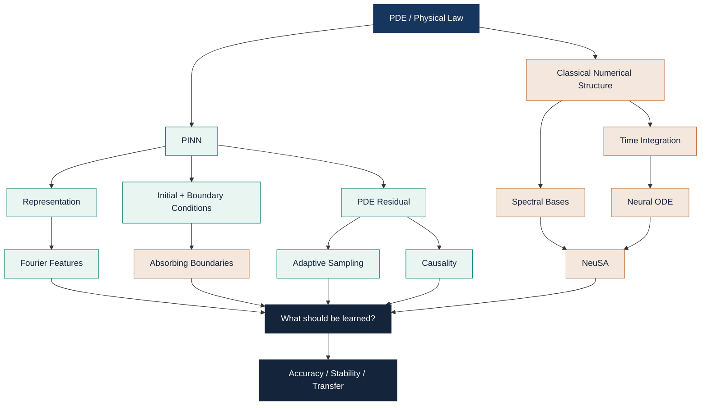

<div align="center">

# 🌊 PINNs @ IMPA
## Scientific Machine Learning — From Physics-Informed Losses to Neuro-Spectral Dynamics

**An interactive mathematical notebook, implementation log, and research atlas**

<br>

[](https://esteargmartacosta.github.io/PINNS-IMPS-LECTURE-COURSE/)
[](#)
[](#)
[](#)

<br>

> ### **The central question**
>
> ## Where should the physics live?
>
> In the loss?  
> In the representation?  
> In the sampling strategy?  
> In the boundary conditions?  
> Or directly in the dynamics?

<br>

**Four weeks. One evolving mental model.**

</div>

---

## 🧭 Explore

- [0. What is a PINN?](#0--what-is-a-pinn)
- [1. Physics as a loss](#1--physics-as-a-loss)
- [2. Causality in time](#2--causality-in-time)
- [3. Spectral bias & Fourier features](#3--spectral-bias--fourier-features)
- [4. Boundary conditions are part of the model](#4--boundary-conditions-are-part-of-the-model)
- [5. Adaptive sampling](#5--adaptive-sampling)
- [6. Neural ODEs](#6--neural-odes)
- [7. Neuro-Spectral Architectures / NeuSA](#7--neuro-spectral-architectures--neusa)
- [8. The error is not one thing](#8--the-error-is-not-one-thing)
- [9. Failure modes](#9--failure-modes)
- [10. What I have learned so far](#10--what-i-have-learned-so-far)
- [11. Experiments](#11--experiments)
- [12. Repository map](#12--repository-map)
- [13. Self-check](#13--self-check)
- [14. References](#14--references)

---

# 🗺️ The mental model



<div align="center">

### Physics can enter a scientific ML model in **many different places**.

</div>

---

# 0 · What is a PINN?

Consider a PDE problem

$$
\mathcal{N}[u](x,t;\lambda)=f(x,t),
\qquad
(x,t)\in\Omega\times[0,T],
$$

with boundary conditions

$$
\mathcal{B}[u](x,t)=g(x,t),
\qquad
(x,t)\in\partial\Omega\times[0,T],
$$

and an initial condition

$$
u(x,0)=u_0(x).
$$

A **Physics-Informed Neural Network** introduces a neural approximation

$$
u_\theta(x,t)\approx u(x,t).
$$

The PDE residual is

$$
\boxed{
r_\theta(x,t)
=
\mathcal{N}[u_\theta](x,t;\lambda)-f(x,t).
}
$$

The network is trained so that the approximation simultaneously satisfies:

- the differential equation,
- the initial condition,
- the boundary conditions,
- and, when available, observed data.

A typical objective has the form

$$
\boxed{
\mathcal{L}(\theta)
=
\lambda_r\mathcal{L}_{r}
+
\lambda_0\mathcal{L}_{0}
+
\lambda_b\mathcal{L}_{b}
+
\lambda_d\mathcal{L}_{d}.
}
$$

with

$$
\mathcal{L}_{r}
=
\frac{1}{N_r}
\sum_{i=1}^{N_r}
|r_\theta(z_i)|^2.
$$

---

<details>
<summary><b>🇨🇴 Intuición en español</b></summary>

<br>

Una PINN intenta representar la solución de la PDE con una red neuronal.

La diferencia frente a una red supervisada usual es que no necesitamos conocer la solución correcta en todos los puntos.

En lugar de decir:

> “la respuesta en este punto es 2.17”

podemos decir:

> “cualquier función correcta debería satisfacer esta ecuación diferencial”.

Entonces la propia PDE se convierte en una fuente de información para entrenar.

La red aprende una función:

\[
(x,t)\mapsto u_\theta(x,t),
\]

y mediante diferenciación automática podemos calcular

\[
u_t,\qquad u_x,\qquad u_{tt},\qquad u_{xx},\ldots
\]

y construir el residuo.

</details>

---

## Automatic differentiation

The derivatives appearing in the PDE are obtained by differentiating the computational graph of the network.

For example,

$$
u_\theta(x,t)
\longrightarrow
\partial_t u_\theta(x,t)
\longrightarrow
\partial_{tt} u_\theta(x,t).
$$

This is not a finite-difference approximation of the neural network output.

It is differentiation of the network itself.

---

## Forward and inverse problems

PINNs can be used for a **forward problem**

$$
\lambda\text{ known}
\quad\Longrightarrow\quad
u\text{ unknown},
$$

or an **inverse problem**

$$
u\text{ partially observed},
\qquad
\lambda\text{ unknown}.
$$

In the inverse case, physical parameters can become trainable:

$$
(\theta,\lambda)
\longleftarrow
\arg\min\mathcal{L}(\theta,\lambda).
$$

---

> [!IMPORTANT]
> A PINN is **not** simply “a neural network plus a PDE penalty”.
>
> Its behavior depends on the representation, sampling distribution, temporal training strategy, boundary treatment, optimization, and numerical structure.

---

# 1 · Physics as a loss

The classical PINN idea is to encode the governing equation through the loss.

For the wave equation

$$
u_{tt}-c^2u_{xx}=0,
$$

the residual becomes

$$
r_\theta(x,t)
=
u_{\theta,tt}(x,t)
-
c^2u_{\theta,xx}(x,t).
$$

We then minimize

$$
\mathcal{L}_{r}
=
\mathbb{E}_{(x,t)\sim q}
\left[
|r_\theta(x,t)|^2
\right].
$$

This formulation immediately reveals something subtle:

## The training distribution \(q\) matters.

We are not enforcing the PDE continuously.

We are enforcing it at sampled locations.

---

<details>
<summary><b>🔬 A zero residual is not enough</b></summary>

Consider

$$
u_{tt}=u_{xx},
\qquad
x\in(0,1),
$$

with homogeneous boundaries.

Every function

$$
u_k(x,t)
=
\sin(k\pi x)\cos(k\pi t)
$$

satisfies the PDE and the boundary conditions.

Therefore,

$$
r[u_k]=0.
$$

But different values of \(k\) correspond to different solutions.

The **initial condition** determines which solution we want.

So:

$$
\boxed{
\text{PDE residual}
\neq
\text{complete problem specification}.
}
$$

</details>

---

# 2 · Causality in time

A time-dependent PDE evolves forward.

But a vanilla PINN can minimize residuals at late times before learning the early-time dynamics correctly.

That creates a mismatch between:

- the causal structure of the PDE,
- and the non-causal structure of the optimization.

A causal strategy divides time into ordered windows

$$
0<t_1<t_2<\cdots<t_K
$$

and forms a weighted objective

$$
\mathcal{L}_{r}
=
\sum_{i=1}^{K}
w_i\mathcal{L}_i.
$$

A schematic causal weighting is

$$
\boxed{
w_i
=
\exp
\left[
-\varepsilon
\sum_{k<i}\mathcal{L}_k
\right].
}
$$

If the early-time residual is large, later windows receive smaller weight.

The optimizer is therefore encouraged to learn the dynamics in temporal order.

---

<details>
<summary><b>🇨🇴 ¿Cuál es la intuición?</b></summary>

<br>

Supón que quieres predecir una onda hasta \(t=10\).

Si todavía estás equivocado cerca de \(t=1\), no tiene demasiado sentido “celebrar” que la red tenga un residuo pequeño en \(t=9\).

La solución física de \(t=9\) depende de lo que ocurrió antes.

La estrategia causal intenta hacer que el entrenamiento respete esa estructura.

</details>

---

> [!CAUTION]
> **Causality does not guarantee accuracy.**
>
> A model can evolve causally from an initial state and still approximate the wrong dynamics.

---

# 3 · Spectral bias & Fourier features

Standard neural networks often learn low-frequency components more easily than high-frequency components.

This phenomenon is commonly called **spectral bias**.

For wave propagation, this is particularly important because the solution may contain high-frequency oscillations.

A Fourier-feature map transforms the coordinates before the MLP:

$$
z=(x,t)
$$

becomes

$$
\boxed{
\gamma(z)
=
\begin{bmatrix}
\sin(2\pi Bz)\\
\cos(2\pi Bz)
\end{bmatrix}.
}
$$

The network becomes

$$
u_\theta(z)
=
N_\theta(\gamma(z)).
$$

Instead of asking the MLP to construct oscillations from raw coordinates, we give it an oscillatory representation from the beginning.

---

## Representation matters

A derivative makes the effect even clearer:

$$
\frac{d^2}{dx^2}\sin(\omega x)
=
-\omega^2\sin(\omega x).
$$

High frequencies are amplified by differentiation.

Therefore, representation and optimization interact strongly in PDE residuals.

---

### Do not confuse these three ideas

| Method | What is spectral? | What evolves? |
|---|---|---|
| Fourier-feature PINN | Input coordinates | Network output \(u_\theta(x,t)\) |
| Spectral PDE solver | Solution basis | Spectral coefficients |
| NeuSA | Solution basis | Coefficients through a Neural ODE |

$$
\boxed{
\text{Fourier features}
\neq
\text{spectral solution dynamics}.
}
$$

---

<details>
<summary><b>🇨🇴 Intuición en español</b></summary>

Las Fourier features cambian **cómo la red ve las coordenadas**.

NeuSA cambia **qué objeto evoluciona en el tiempo**.

Aunque ambas ideas usan senos/cosenos o conceptos de frecuencia, matemáticamente cumplen papeles diferentes.

</details>

---

# 4 · Boundary conditions are part of the model

In wave propagation, a computational domain is finite.

But the physical domain may represent an effectively unbounded medium.

If waves hit an artificial boundary and reflect back, the numerical problem has changed.

For a 1D right-going wave, a simple outgoing condition has the form

$$
\boxed{
u_t+c\,u_x=0.
}
$$

At the opposite boundary, the sign changes.

More sophisticated absorbing boundary conditions use operators such as

$$
\boxed{
\prod_{j=1}^{m}
\left(
\partial_t+c_j\partial_n
\right)u
=
0.
}
$$

The constants \(c_j\) can be selected to reduce reflections for targeted propagation directions.

---

## Why this matters for PINNs

A PINN can achieve a low interior PDE residual and still produce physically incorrect reflections.

The boundary is therefore **not an implementation detail**.

It is part of the mathematical problem.

---

<details>
<summary><b>🌊 Thought experiment</b></summary>

Suppose a wave propagates toward the right edge of the computational domain.

Two models satisfy the PDE extremely well in the interior.

- Model A lets the wave leave.
- Model B reflects 20% of the amplitude back into the domain.

Their interior residuals can still look similar.

But their physical behavior is completely different.

</details>

---

# 5 · Adaptive sampling

PINNs do not enforce the PDE everywhere.

They observe it through collocation points.

Suppose points are drawn from a distribution \(q(z)\). Then

$$
\boxed{
\mathcal{L}_r
=
\mathbb{E}_{z\sim q}
\left[
|r_\theta(z)|^2
\right].
}
$$

Changing \(q\) changes where the optimizer looks.

---

## Uniform sampling

$$
q(z)
=
\text{constant}.
$$

Every region receives approximately equal sampling probability.

---

## Residual-based adaptive sampling

A strategy may increase sampling probability where

$$
|r_\theta(z)|
$$

is large.

Conceptually,

$$
q_{\text{new}}(z)
\propto
\Phi(|r_\theta(z)|),
$$

for some increasing function \(\Phi\).

---

## A subtle point

If we want to estimate an expectation under a target distribution \(p\) while sampling from \(q\), importance weighting gives

$$
\mathbb{E}_{p}[f(z)]
=
\mathbb{E}_{q}
\left[
\frac{p(z)}{q(z)}f(z)
\right].
$$

Therefore, changing the sampling distribution **without compensating weights** may change the effective objective.

That distinction matters when interpreting adaptive sampling experiments.

---

<details>
<summary><b>🇨🇴 La idea importante</b></summary>

Adaptive sampling no significa solamente:

> “poner más puntos donde algo interesante ocurre”.

También puede modificar qué regiones pesan más en el entrenamiento.

Por eso debemos distinguir:

1. cambiar dónde observamos el residuo;
2. cambiar cuánto pesa cada región;
3. cambiar ambas cosas simultáneamente.

</details>

---

# 6 · Neural ODEs

A Neural ODE parameterizes a continuous-time vector field:

$$
\boxed{
\frac{dz}{dt}
=
f_\theta(t,z).
}
$$

Given

$$
z(0)=z_0,
$$

the trajectory is

$$
z(t)
=
z_0
+
\int_0^t
f_\theta(s,z(s))\,ds.
$$

The neural network does not directly predict the complete trajectory.

It predicts the **velocity field** that generates the trajectory.

---

## Connection with residual networks

Explicit Euler gives

$$
z_{n+1}
=
z_n
+
h\,f_\theta(t_n,z_n).
$$

Compare this with a residual block

$$
z_{n+1}
=
z_n+F_\theta(z_n).
$$

This motivates the interpretation of Neural ODEs as continuous-depth dynamical systems.

---

## Numerical integration now becomes part of the model

If

$$
z'=f_\theta(z),
$$

we still need an integrator.

For classical RK4:

$$
\begin{aligned}
k_1 &= f_\theta(z_n),\\
k_2 &= f_\theta(z_n+\tfrac h2 k_1),\\
k_3 &= f_\theta(z_n+\tfrac h2 k_2),\\
k_4 &= f_\theta(z_n+h k_3),
\end{aligned}
$$

and

$$
\boxed{
z_{n+1}
=
z_n
+
\frac{h}{6}
(k_1+2k_2+2k_3+k_4).
}
$$

---

> [!IMPORTANT]
> Once a learned dynamical system is integrated numerically,
>
> **model error and integration error interact.**

---

<details>
<summary><b>🧠 Backpropagation through an integrator</b></summary>

One numerical step can be written as

$$
z_{n+1}
=
\Psi_h(z_n,\theta).
$$

Therefore,

$$
\frac{\partial z_{n+1}}{\partial\theta}
=
D_z\Psi_h
\frac{\partial z_n}{\partial\theta}
+
D_\theta\Psi_h.
$$

Automatic differentiation can differentiate through all numerical operations used by the integrator.

The continuous adjoint method is another strategy, but a Neural ODE does **not** require the adjoint method by definition.

</details>

---

# 7 · Neuro-Spectral Architectures / NeuSA

NeuSA combines:

- a spectral spatial representation,
- known analytical dynamics,
- a learned correction,
- and time integration.

Represent the field as

$$
\boxed{
u_M(t,x)
=
\sum_{k=1}^{M}
a_k(t)\phi_k(x).
}
$$

For a sine basis on \([-4,4]\),

$$
\phi_k(x)
=
\sin
\left(
\frac{k\pi(x+4)}{8}
\right).
$$

These basis functions automatically satisfy

$$
\phi_k(-4)=\phi_k(4)=0.
$$

Hence

$$
u_M(t,-4)=u_M(t,4)=0.
$$

---

## Spectral differentiation

Define

$$
\omega_k=\frac{k\pi}{8}.
$$

Then

$$
\phi_k''(x)
=
-\omega_k^2\phi_k(x).
$$

Therefore

$$
u_{xx}
=
\sum_k
-\omega_k^2a_k(t)\phi_k(x).
$$

Spatial differentiation becomes a diagonal operation on the coefficient vector:

$$
\boxed{
a
\mapsto
-\Omega^2a.
}
$$

This is classical numerical structure embedded directly into the architecture.

---

## Turning the PDE into coefficient dynamics

For the sine-Gordon equation

$$
u_{tt}
=
u_{xx}
-
10\sin(u),
$$

introduce

$$
b=a'.
$$

A spectral dynamical system has the form

$$
\boxed{
\begin{aligned}
a' &= b,\\
b' &=
-\Omega^2a
+
\mathcal{P}_M
\left[
-10\sin(\mathcal{S}_M a)
\right].
\end{aligned}
}
$$

where

- \(\mathcal{S}_M\) reconstructs nodal field values,
- \(\mathcal{P}_M\) maps nodal values back to spectral coefficients.

The nonlinearity acts in physical space and therefore mixes spectral modes.

---

## NeuSA idea

Instead of representing the entire right-hand side numerically, introduce a learned correction:

$$
\boxed{
a' = b,
\qquad
b'
=
-\Omega^2a
+
\varepsilon N_\theta(a).
}
$$

Known structure remains explicit.

Unknown or difficult structure is learned.

---

<details>
<summary><b>🇨🇴 La intuición central</b></summary>

En una PINN clásica:

\[
(x,t)\rightarrow u_\theta(x,t).
\]

En NeuSA:

\[
u_0
\rightarrow
a(0)
\rightarrow
\text{ODE de coeficientes}
\rightarrow
a(t)
\rightarrow
u(t,x).
\]

No preguntamos a la red:

> “¿cuál es la solución en \(x,t\)?”

Le preguntamos:

> “¿cómo debe evolucionar este estado espectral?”

</details>

---

# 8 · The error is not one thing

One of the most important lessons from these experiments is that **error has multiple sources**.

Conceptually,

$$
u_{\theta,M,h}-u
=
\underbrace{
u_{\theta,M,h}-u_{\theta,M}
}_{\text{time integration}}
+
\underbrace{
u_{\theta,M}-u_M^\ast
}_{\text{learned dynamics}}
+
\underbrace{
u_M^\ast-u
}_{\text{spatial discretization}}.
$$

where

- \(M\) = spatial resolution,
- \(h\) = time step,
- \(u_M^\ast\) = solution of the spatially discretized reference dynamics.

These terms are not independently observable in general.

And their norms do **not** simply add.

---

## Why diagnostics matter

A smaller training loss can coexist with:

- worse reference error,
- worse transfer,
- boundary reflections,
- integration error,
- spatial truncation error,
- poor energy behavior.

Therefore:

$$
\boxed{
\text{training loss}
\neq
\text{solution error}
\neq
\text{transfer error}.
}
$$

---

# 9 · Failure modes

| Failure mode | What can look good | What can still be wrong |
|---|---|---|
| Low PDE residual | Training loss | Initial/boundary conditions |
| Spectral bias | Low-frequency behavior | High-frequency wave content |
| Non-causal training | Global loss | Early-time dynamics |
| Boundary mismatch | Interior residual | Artificial reflections |
| Uniform sampling | Average residual | Local difficult regions |
| More modes | Reference discretization | Neural optimization |
| Smaller \(h\) | Integration accuracy | Learned vector field |
| Energy conservation | Global invariant | Phase / waveform |
| Excellent train fit | Training trajectory | New initial conditions |
| More parameters | Capacity | Transfer / runtime |

---

# 10 · What I have learned so far

<div align="center">

## Physics is not only a term in the loss.

</div>

It can enter through:

### ① The loss

$$
\mathcal{L}_r
=
\| \mathcal{N}[u_\theta]-f \|^2.
$$

### ② The representation

$$
u_\theta(\gamma(x,t))
$$

or

$$
u_M
=
\sum_k a_k\phi_k.
$$

### ③ The sampling strategy

$$
z\sim q_\theta(z).
$$

### ④ The boundaries

$$
\mathcal{B}[u]=0.
$$

### ⑤ The temporal structure

$$
t_1<t_2<\cdots<t_K.
$$

### ⑥ The dynamical architecture

$$
z'=f_\theta(z).
$$

### ⑦ The numerical integrator

$$
z_{n+1}
=
\Psi_h(z_n).
$$

---

> [!TIP]
> A useful SciML question is therefore not:
>
> **“Can a neural network solve this PDE?”**
>
> but rather:
>
> ## “Which piece of classical numerical structure should be built into the learning problem — and which failure mode does that choice actually fix?”

---

## Four-week synthesis

| Week | Core idea | My current interpretation |
|---|---|---|
| **1** | PINNs | Physics can constrain a neural function |
| **2** | Causality + spectral bias | Optimization and representation matter |
| **3** | Boundaries + sampling | The computational domain is part of the learning problem |
| **4** | Neural ODEs + NeuSA | Physics can be embedded directly into learned dynamics |

---

# 11 · Experiments

## 🔬 Interactive experimental atlas

<div align="center">

### 👉 [Open the full interactive results explorer](https://esteargmartacosta.github.io/PINNS-IMPS-LECTURE-COURSE/)

</div>

The GitHub Page contains the interactive version of the theory map, experiment protocols, and results.

---

## NeuSA — analytical structure

Using

$$
-10\sin(u)
=
-10u
+
10(u-\sin u),
$$

we tested a modified analytical initialization:

$$
\boxed{
a'=b,
\qquad
b'
=
-(\Omega^2+10I)a
+
0.1N_\theta(a).
}
$$

Compared with the baseline, the linearized variant reduced error consistently across three seeds under the controlled \(T=1\) protocol.

---

## NeuSA — local structured correction

We then tested a shared scalar correction

$$
r_\theta:\mathbb{R}\rightarrow\mathbb{R},
$$

instead of a global map

$$
N_\theta:\mathbb{R}^{201}\rightarrow\mathbb{R}^{201}.
$$

The local cubic correction was constructed so that

$$
r_\theta(-u)
=
-r_\theta(u)
$$

and

$$
r_\theta(u)
=
O(u^3)
\qquad
u\rightarrow0.
$$

The goal was not simply to reduce parameter count.

The goal was to test whether **structural inductive bias improves transfer**.

---

<details>
<summary><b>📌 Main experimental lesson</b></summary>

For the original pulse, the large global model achieved the smallest error on the training interval.

But the local structured model transferred substantially better to later times and to several unseen initial conditions.

Therefore, under this protocol:

$$
\boxed{
\text{better trajectory fit}
\not\Rightarrow
\text{better learned dynamics}.
}
$$

This is an empirical observation for this experiment — not a universal theorem.

</details>

---

<details>
<summary><b>⚠️ What the experiment does NOT prove</b></summary>

It does not prove that:

- local models are universally superior;
- fewer parameters imply faster training;
- NeuSA replaces classical PDE solvers;
- the learned force is globally accurate;
- causality guarantees extrapolation;
- three seeds establish universal statistical superiority.

</details>

---

# 12 · Repository map

```text
PINNS-IMPS-LECTURE-COURSE/
│
├── README.md
│
├── docs/
│   ├── index.html
│   ├── styles.css
│   ├── app.js
│   └── data/
│       ├── concepts.js
│       └── results.js
│
├── experiments/
│   ├── pinns/
│   ├── fourier_features/
│   ├── adaptive_sampling/
│   ├── boundaries/
│   └── neusa/
│
├── results/
│   ├── processed/
│   └── metadata/
│
└── scripts/
```

The intended research pipeline is


---

# 13 · Self-check

<details>
<summary><b>❓ Can the PDE residual be zero while the solution is wrong?</b></summary>

Yes.

A differential equation generally admits many solutions.

Initial and boundary conditions identify the desired solution.

</details>

---

<details>
<summary><b>❓ Are Fourier features and spectral bases the same thing?</b></summary>

No.

Fourier features transform the **input representation of a neural network**.

A spectral basis represents the **solution itself** using modal coefficients.

</details>

---

<details>
<summary><b>❓ Does adaptive sampling only change computational efficiency?</b></summary>

Not necessarily.

If sampling changes without appropriate reweighting, the effective training objective can change.

</details>

---

<details>
<summary><b>❓ Does causal evolution imply accurate extrapolation?</b></summary>

No.

Causality describes how the state evolves from the initial condition.

Accuracy describes whether the learned vector field approximates the correct dynamics.

</details>

---

<details>
<summary><b>❓ If I increase the number of spectral modes, must the neural model improve?</b></summary>

No.

Spatial discretization error may decrease while optimization or approximation error remains unchanged — or even becomes harder.

</details>

---

<details>
<summary><b>❓ Is a small energy drift enough to certify an accurate solution?</b></summary>

No.

Two trajectories may have similar energy while differing in phase, waveform, or local behavior.

</details>

---

<details>
<summary><b>❓ What is the difference between model error and integration error?</b></summary>

The learned vector field can be wrong even if the ODE is integrated perfectly.

Conversely, a good vector field can be evaluated poorly using an inadequate time step.

Both effects must be diagnosed separately.

</details>

---

# 14 · References

### PINNs

**Raissi, M., Perdikaris, P., & Karniadakis, G. E. (2019).**  
*Physics-informed neural networks: A deep learning framework for solving forward and inverse problems involving nonlinear partial differential equations.*  
Journal of Computational Physics, 378, 686–707.  
https://doi.org/10.1016/j.jcp.2018.10.045

---

### Causality

**Wang, S., Sankaran, S., & Perdikaris, P. (2024).**  
*Respecting causality for training physics-informed neural networks.*  
Computer Methods in Applied Mechanics and Engineering, 421, 116813.  
https://doi.org/10.1016/j.cma.2024.116813

---

### Fourier features for wave propagation

**Ding, Y., Chen, S., Miyake, H., & Li, X. (2025).**  
*Physics-Informed Neural Networks With Fourier Features for Seismic Wavefield Simulation in Time-Domain Nonsmooth Complex Media.*  
IEEE Transactions on Geoscience and Remote Sensing.  
https://arxiv.org/abs/2409.03536

---

### Adaptive training and acoustic waves

**Marques, M. et al. (2025).**  
*Stable adaptive training for physics-informed neural networks in acoustic wave propagation.*  
JASA Express Letters, 5(11), 112401.  
https://doi.org/10.1121/10.0039767

---

### Neural ODEs

**Chen, R. T. Q., Rubanova, Y., Bettencourt, J., & Duvenaud, D. K. (2018).**  
*Neural Ordinary Differential Equations.*  
NeurIPS 2018.  
https://arxiv.org/abs/1806.07366

---

### NeuSA

**Bizzi, A. et al. (2025).**  
*Neuro-Spectral Architectures for Causal Physics-Informed Networks.*  
NeurIPS 2025.  
https://arxiv.org/abs/2509.04966

---

<div align="center">

<br>

# 🌊 SciML Atlas

### Theory → Code → Experiment → Evidence → Limitation

<br>

[](https://esteargmartacosta.github.io/PINNS-IMPS-LECTURE-COURSE/)

<br>

**Built as a living research notebook for the SciML Reading & Implementation Seminar at IMPA.**

</div>
